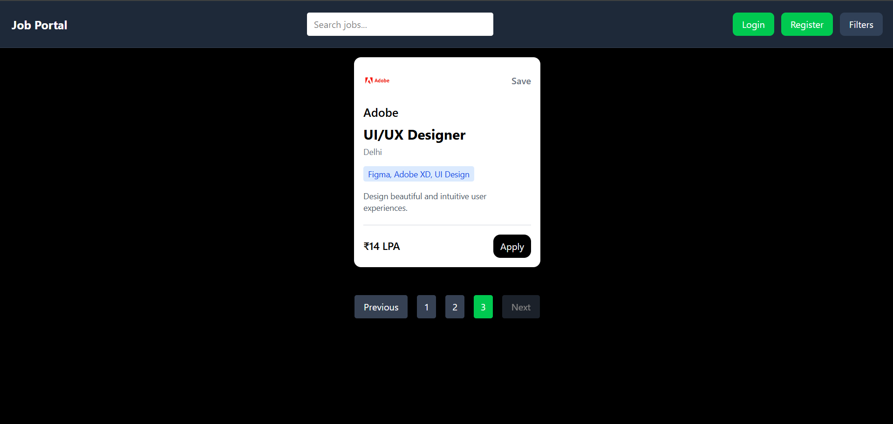
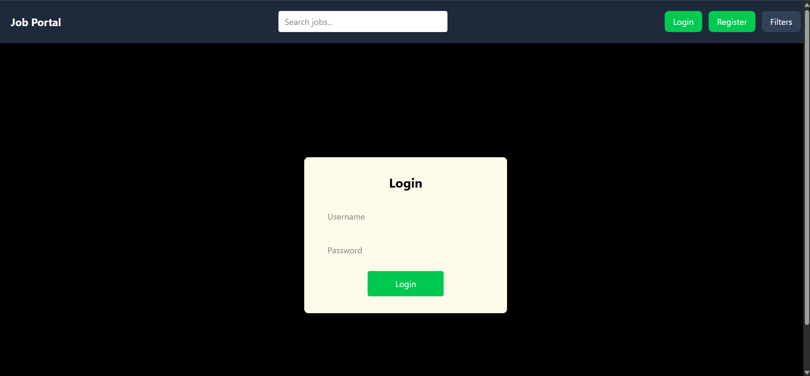
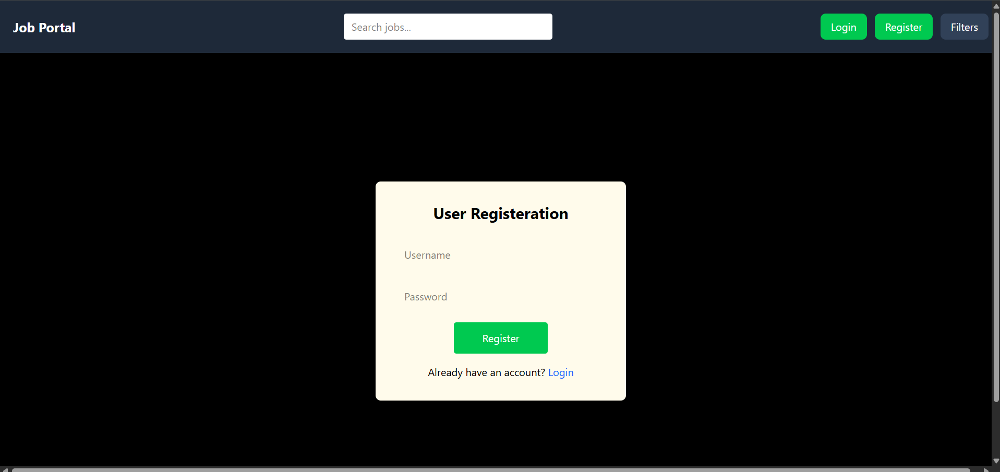
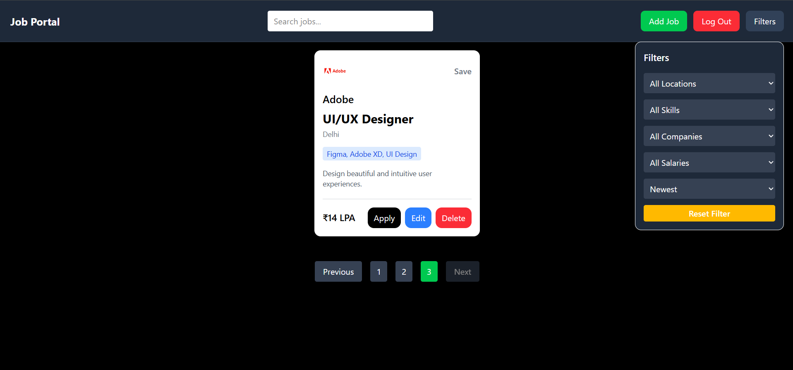
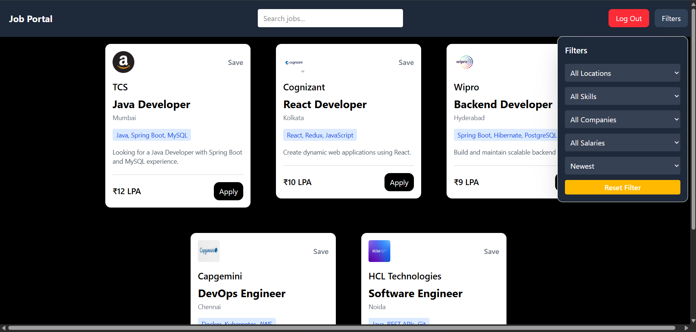
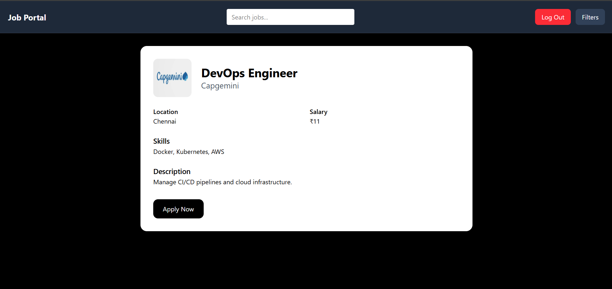

#  Job Portal

A full-stack Job Portal application built using **React**, **Spring Boot**, **Spring Security**, **JWT Authentication**, and **MySQL**.

This project allows users to browse job listings while providing secure role-based access for administrators to manage job postings.

---

# Screenshots

## Home Page



---

## Login Page



---

## Registration Page



---

## Admin Dashboard



---

## User Dashboard



## Job Detail Page



#  Features

## Job Management

* View Job Listings
* Search Jobs
* Filter Jobs
* Pagination
* Sorting
* Responsive UI

## Authentication

* User Registration
* User Login
* JWT Authentication
* Secure Logout
* Password Encryption using BCrypt

## Authorization

### USER

* View Jobs
* Search Jobs
* Filter Jobs

### ADMIN

* Add Jobs
* Edit Jobs
* Delete Jobs
* Full Job Management Access

## Security

* Spring Security
* JWT Token Validation
* Role-Based Access Control
* Protected Routes
* Axios Interceptor
* CORS Configuration

---

# Tech Stack

## Frontend

* React
* React Router DOM
* Axios
* Tailwind CSS
* React Toastify

## Backend

* Spring Boot
* Spring Security
* Spring Data JPA
* JWT (JSON Web Token)
* Maven

## Database

* MySQL

---

#  Project Structure

```text
JOB_Portal
│
├── Frontend
│   └── job-portal
│
├── Backend
│   └── Job_portal
│
├── screenshots
│   ├── home.png
│   ├── login.png
│   ├── register.png
│   └── admin-dashboard.png
│
└── README.md
```

---

# Role-Based Access

| Feature     | Guest | User | Admin |
| ----------- | ----- | ---- | ----- |
| View Jobs   | yes     | yes    | yes     |
| Search Jobs | yes     | yes    | yes     |
| Filter Jobs | yes     | yes    | yes     |
| Add Job     | No     | No    | yes     |
| Edit Job    | No     | No    | yes     |
| Delete Job  | No     | No    | yes     |

---

#  Installation

## Clone Repository

```bash
git clone https://github.com/YourUsername/Job-Portal.git
```

## Backend Setup

```bash
cd Backend/Job_portal
```

Configure MySQL database in:

```properties
application.properties
```

Run the application:

```bash
mvn spring-boot:run
```

---

## Frontend Setup

```bash
cd Frontend/job-portal
```

Install dependencies:

```bash
npm install
```

Start development server:

```bash
npm run dev
```

---

#  Authentication Flow

1. Register a new account
2. Login using credentials
3. Receive JWT Token
4. Token stored in Local Storage
5. Axios Interceptor automatically attaches token
6. Backend validates JWT
7. Role-Based Authorization applied

---

#  Future Enhancements

* Resume Upload
* Apply for Jobs
* Application Tracking
* User Dashboard
* Saved Jobs
* Profile Management
* Email Notifications
* Job Analytics

---

#  Author

**Atul Yadav**

Built as a learning project to practice:

* React
* Spring Boot
* Spring Security
* JWT Authentication
* MySQL
* Full-Stack Development
